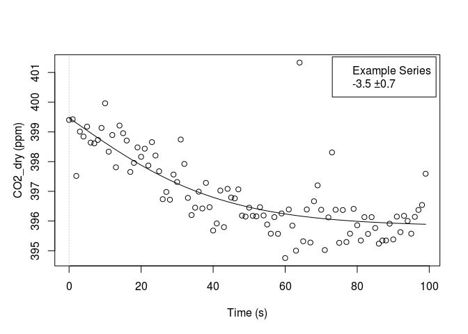

<!-- 
README.md is generated from README.Rmd. Please edit that file
#knitr::knit("README.Rmd") 
rmarkdown::render("README.Rmd") 
maybe clear cache before
-->
[](https://travis-ci.org/bgctw/RespChamberProc)

<!-- 
[](http://cran.r-project.org/package=REddyProc)

# From CRAN
install.packages("logitnorm")

# Or the the development version from GitHub:
-->
Overview
--------

`RespChamberProc` package supports deriving gas fluxes from a time series of gas concentrations in a chamber.

Installation
------------

``` r
install.packages( # dependencies from CRAN
  c("rlang", "changepoint", "nlme", "segmented", "tibble",  "dplyr", "purrr"))
# install.packages("devtools")
devtools::install_github("bgctw/RespChamberProc")
```

<!-- 
-->
Usage
-----

See the [package vignettes](../../tree/master/vignettes) for an introduction.

A simple example estimates photosynthesis (negative CO2 flux into the light chamber) in units micromol/second from CO2 concentration data in ppm.

``` r
library(RespChamberProc)
#?RespChamberProc

ds <- chamberLoggerEx1s               # example data with the package
ds$Pa <- chamberLoggerEx1s$Pa * 1000  # convert kPa to Pa
ds$CO2_dry <- corrConcDilution(ds)    # correct for water vapour
resFit <- calcClosedChamberFlux(
  ds
  , colConc = "CO2_dry", colTime = "TIMESTAMP"  
  , colTemp = "TA_Avg", colPressure = "Pa"  # Temperature in K, Pressure in Pa
  , volume = 1, area = 1                    # chamber dimensions m3 and m2
)
dplyr::select(resFit ,c("flux","sdFlux"))
#> # A tibble: 1 x 2
#>        flux    sdFlux
#>       <dbl>     <dbl>
#> 1 -3.534767 0.7084692
plotResp(ds, resFit, label = "Example Series")
```


