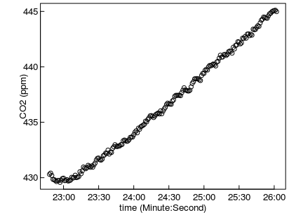

Processing several measurement cycles
=====================================


```r
if (!exists("isDevelopMode")) library(RespChamberProc)
set.seed(0815)      # for reproducible results
```

Determine subsets of single measurment cycles
----------------------------------------------

First, the data is loaded. Here, directly from zipped logger-output.

```r
fName <- system.file(
  "genData/SMANIE_Chamber1_26032015.zip", package = "RespChamberProc")
if (nzchar(fName) ) { 
  ds <- readDat(
    unz(fName, filename = unzip(fName, list = TRUE)[1,"Name"] ),tz = "UTC") }
head(ds)
plot( CO2_LI840 ~ TIMESTAMP, ds, ylab = "CO2 (ppm)", xlab = "Time")
```

<!-- -->

```
## # A tibble: 6 x 17
##             TIMESTAMP RECORD Chamber Collar AirTemp  AirPres      PAR
##                <dttm>  <int>   <int>  <int>   <dbl>    <dbl>    <dbl>
## 1 2015-03-26 06:18:28 261827       1      0   5.136 987.6682 5.295341
## 2 2015-03-26 06:18:29 261828       1      0   5.136 987.7363 5.295341
## 3 2015-03-26 06:18:30 261829       1      0   5.136 987.6682 5.295341
## 4 2015-03-26 06:18:31 261830       1      0   5.126 987.7363 5.295341
## 5 2015-03-26 06:18:32 261831       1      0   5.126 987.6682 5.295341
## 6 2015-03-26 06:18:33 261832       1      0   5.126 987.6682 5.295341
## # ... with 10 more variables: BodyTemp <dbl>, SurTemp <dbl>,
## #   SoilTemp <dbl>, SoilMoist <dbl>, CO2_LI840 <dbl>, H2O_LI840 <dbl>,
## #   T_LI840 <dbl>, P_LI840 <dbl>, PTemp <dbl>, Batt <dbl>
```

The dataset contains several measurment cycles of light and dark chambers 
with increasing or decreasing concentations respectively.

First, we correct the pressure to standard units and correct the CO2
concentrations for water vapour.

```r
ds$Pa <- ds$AirPres * 100  # convert hPa to Pa
ds$CO2_dry <- corrConcDilution(ds, colConc = "CO2_LI840", colVapour = "H2O_LI840")
ds$H2O_dry <- corrConcDilution(ds, colConc = "H2O_LI840", colVapour = "H2O_LI840")
ds$VPD <- calcVPD( ds$SurTemp, ds$Pa, ds$H2O_LI840)
```

In order to process each measurement cycle independently, we first determine 
parts of the time series that are contiguous, i.e. without gaps and without 
change of an index variable, here variable `collar`.


```r
dsChunk <- subsetContiguous(ds, colTime = "TIMESTAMP", colIndex = "Collar") 
head(dsChunk)
```

```
## # A tibble: 6 x 22
##   iChunk           TIMESTAMP RECORD Chamber Collar AirTemp  AirPres
##   <fctr>              <dttm>  <int>   <int>  <int>   <dbl>    <dbl>
## 1      4 2015-03-26 06:19:20 261864       1      1   4.993 987.7363
## 2      4 2015-03-26 06:19:21 261865       1      1   4.993 987.8045
## 3      4 2015-03-26 06:19:22 261866       1      1   4.984 987.7363
## 4      4 2015-03-26 06:19:23 261867       1      1   4.984 987.8045
## 5      4 2015-03-26 06:19:24 261868       1      1   4.984 987.8045
## 6      4 2015-03-26 06:19:25 261869       1      1   4.984 987.8045
## # ... with 15 more variables: PAR <dbl>, BodyTemp <dbl>, SurTemp <dbl>,
## #   SoilTemp <dbl>, SoilMoist <dbl>, CO2_LI840 <dbl>, H2O_LI840 <dbl>,
## #   T_LI840 <dbl>, P_LI840 <dbl>, PTemp <dbl>, Batt <dbl>, Pa <dbl>,
## #   CO2_dry <dbl>, H2O_dry <dbl>, VPD <dbl>
```

The new modified contains a new variable, `iChunk`, holding a factor that
changes with different measurment cycles.
This factor can be used to select subset of single measurement cycles. 

```r
dss <- subset(dsChunk, iChunk == 15)
plot( CO2_dry ~ TIMESTAMP, dss, ylab = "CO2 (ppm)", xlab = "time (Minute:Second)")
```

<!-- -->

Computing the flux
------------------

Function `calcClosedChamberFluxForChunks` helps you with subsetting the data 
and applying function `calcClosedChamberFlux` to each subset.


```r
# for demonstration use only the first 20 cycles
dsChunk20 <- subset(dsChunk, as.integer(iChunk) <= 20) 
chamberVol = 0.6*0.6*0.6		# chamber was a cube of 0.6m length
surfaceArea = 0.6*0.6

resChunks1 <- calcClosedChamberFluxForChunks(
  dsChunk20, colTemp = "T_LI840"
  # linear and saturating shape
  , fRegress = c(lin = regressFluxLinear, tanh = regressFluxTanh)	
  , debugInfo = list(omitEstimateLeverage = TRUE)	# faster
  , volume = chamberVol
  , area = surfaceArea
)
head(resChunks1)
```

```
## # A tibble: 6 x 16
## # Groups:   iChunk [6]
##   iChunk     flux fluxMedian      sdFlux  tLag lagIndex  autoCorr
##   <fctr>    <dbl>      <dbl>       <dbl> <dbl>    <int>     <dbl>
## 1      4 2.064670         NA 0.017284759     0        1 0.7054929
## 2      5 2.267797         NA 0.023260267     0        1 0.4862560
## 3      6 1.987172         NA 0.010605873     6        7 0.5562358
## 4      7 2.176030         NA 0.020329119     0        1 0.4185527
## 5      8 1.103253         NA 0.022461987    10       11 0.4499593
## 6      9 1.561600         NA 0.009077496     3        4 0.4984416
## # ... with 9 more variables: AIC <dbl>, sdFluxRegression <dbl>,
## #   sdFluxLeverage <dbl>, iFRegress <dbl>, sdResid <dbl>, iqrResid <dbl>,
## #   r2 <dbl>, times <list>, model <list>
```

The results are similar as for `calcClosedChamberFlux`, unless there are 
several rows identified by additional key column iChunk.

## Plotting faceted data and fits
Plot the results to dectect problems. 

```r
library(ggplot2)
plots <- plotCampaignConcSeries( dsChunk20, resChunks1, plotsPerPage = 64L)  
print(plots$plot[[1]]) # print the first page
```

<!-- -->

If argument `fileName` is provided to `plotCampaignConcSeries`. All plots are
written to a pdf. If there are more cycles, i.e. plots, than argument 
`plotsPerPage`(default 64) there will be several pages in the pdf.


