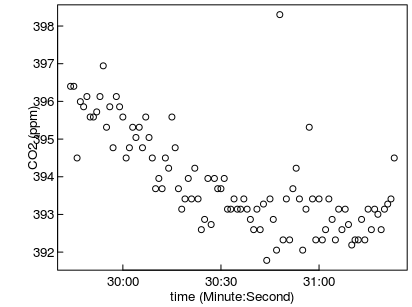
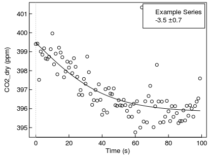

CO2 fluxes from Chamber CO2 concentrations
======================================================


```r
#isDevelopMode <- TRUE
if (!exists("isDevelopMode")) library(RespChamberProc)
set.seed(0815)      # for reproducible results
```

Preparing the chamber data
------------------------------

First, the data is loaded. This is a typical data.frame as obtained from a
logger file of a light chamber with photosynthetic plants in it, for a single
chamber measurement cycle. For timestamps spaced about every second, the
sensor readings from CO2 concentration in ppm, vater vapour in ppm, chamber
temperaturein degree Celsius and air pressure, here in kPa are recorded.


```r
ds <- chamberLoggerEx1s  # dataset lazyload from package
head(ds)
plot( CO2_Avg ~ TIMESTAMP, ds, ylab = "CO2 (ppm)", xlab = "time (Minute:Second)")
```

<!-- -->

```
##             TIMESTAMP RECORD batt_volt_Avg PTemp_Avg  CO2_Avg  H20_Avg
## 1 2013-03-11 08:29:44 105398         12.28  14.89953 396.4001 7.520463
## 2 2013-03-11 08:29:45 105399         12.29  14.89953 396.4001 7.574802
## 3 2013-03-11 08:29:46 105400         12.33  14.89953 394.4983 7.596537
## 4 2013-03-11 08:29:47 105401         12.32  14.89953 395.9926 7.563934
## 5 2013-03-11 08:29:48 105402         12.31  14.89953 395.8567 7.487860
## 6 2013-03-11 08:29:49 105403         12.30  14.89953 396.1284 7.640008
##     TA_Avg   TC_Avg   SB_Avg ATT_C_Avg e_sat_Avg PAR_I_in_Avg  Pa
## 1 19.82878 13.65029 15.35369  13.29104  23.10753     633.6682 101
## 2 20.12273 13.61751 15.37052  13.25733  23.53238     636.9012 101
## 3 20.45702 13.61725 15.36211  13.25733  24.02386     635.2847 101
## 4 20.33153 13.60867 15.35369  13.24890  23.83832     638.5177 101
## 5 20.37187 13.58369 15.35369  13.22362  23.89783     639.3259 101
## 6 20.12456 13.60919 15.37052  13.24890  23.53505     639.3259 101
```

RespChamberProc demands the pressure in units Pascal, so we need to convert from
kPa. 

```r
ds$Pa <- chamberLoggerEx1s$Pa * 1000  # convert kPa to Pa
```

RespChamberProc works with concentrations of CO2 per dry air. There was
vater vapour in the chamber and CO2 concentrations are measured per wet air. We
need to compute the concentrations per dry air.

```r
conc <- ds$CO2_dry <- corrConcDilution(ds)
```

Computing the flux
---------------------
The CO2-flux is the change of concentration per time, i.e. the slope of the
concentration change. Usually, the changing concentration within the chamber
over time decreases the slope voer time. Hence, RespChamberProc fits several
functional forms to the CO2~time relationship and reports the intial slope of
the best-fitting form.


```r
resFit <- calcClosedChamberFlux(ds
		, colConc = "CO2_dry", colTime = "TIMESTAMP"	# colum names conc ~ timeInSeconds
		, colTemp = "TA_Avg", colPressure = "Pa"		# Temperature in K, Pressure in Pa
		, volume = 1, area = 1						    # chamber dimensions m3 and m2
)
```

`calcClosedChamberFlux` expects the time in seconds. Providing a vector
of POSIXct is ok.
Moreover, the dimensions of the chamber must be given, the inside chamber air
volume in cubic meter, and the area (in square meter) of the exchange area
between the chamber and the studied object. This area is usually the area of the
open bottom side ofthe chamber. 

If the chamber encloses an objects, set the area to 1 and interpret the flux in
micromol/second instead of micromol/square meter/second.

In order to convert (change of) concentrations to amount of substance, 
the pressure (in Pa) and temperature (in Kelvin) inside
the chamber are required in addition to volume in order to apply the idal gas law.  
The flux is proportional to pressure. Hence, if pressure is not recorded with
the logger file, one may compute with a average pressure of Pa=100*1000, and
correct fluxes post-hoc when an esitmate of air pressure becomes available
from meteorological data.


Inspecting the results
-------------------------

Its a one-row tibble, i.e. a kind of tabular data like a data.frame, with 
fitting statistics and fitted model objects. While all the first columns are 
numeric, column `times` holds a vector of times after lag-phase for which c
oncentration predictions have benn made by the model object given in 
column `model` (see explanations on the graph below).


```r
resFit
```

```
## # A tibble: 1 x 15
##        flux fluxMedian    sdFlux  tLag lagIndex autoCorr      AIC
##       <dbl>      <dbl>     <dbl> <dbl>    <int>    <dbl>    <dbl>
## 1 -3.534767  -3.803958 0.7084692     0        1       NA 253.7607
## # ... with 8 more variables: sdFluxRegression <dbl>, sdFluxLeverage <dbl>,
## #   iFRegress <dbl>, sdResid <dbl>, iqrResid <dbl>, r2 <dbl>,
## #   times <list>, model <list>
```

The most important information are the estimate of the flux, and its
uncertainty, both in unit mumol/m2/s:

```r
resFit[,c("flux","sdFlux")]
```

```
## # A tibble: 1 x 2
##        flux    sdFlux
##       <dbl>     <dbl>
## 1 -3.534767 0.7084692
```

Or in gC/m2/day:

```r
fluxInMuMol <- unlist(resFit[,c("flux","sdFlux")])
convert_mumolPers_to_gPerday(fluxInMuMol)
```

```
##       flux     sdFlux 
## -3.6682062  0.7352142
```


The results can be visualized in a plot:

```r
plotResp(ds, resFit, label = "Example Series")		
```

<!-- -->

The fitted form (solid line) approximates the change of measured concentration
(points) over time. Usually there is a lag-time (dotted vertical line) between
concentration change, and when the time when the signal reaches the sensor. The
flux after the intial lag-time is reported at the top left together with its
uncertainty in mumol/m2/s.
The label can be provided to distinguish different measurement cycles.
